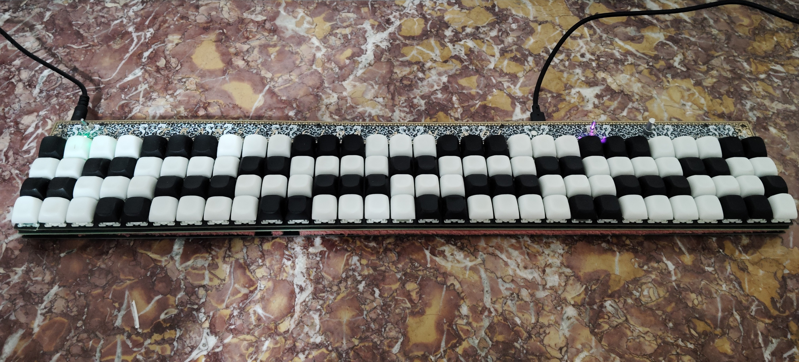

# Clavicore 0.1

Le Clavicore est un contrôleur midi sensible à la vélocité. Il est basé sur la disposition Janko. 
Il fonctionne grâce à des interrupteurs MX magnétiques et un Teensy 4.1.  

---

## JANKO LAYOUT

Contrairement à un piano standard, l’écart physique entre les touches correspond à l’écart musical entre les notes. Il y a un ton de différence sur les lignes et un demi-ton sur les colonnes. Toutes les gammes partagent le même doigté pour des accords identiques et sont jouées de la même manière.  

https://en.wikipedia.org/wiki/Jank%C3%B3_keyboard

## FONCTIONNEMENT

La position des touches est suivie grâce à des capteurs halls. Huit multiplexeurs permettent de transmettre le voltage émis par les 120 capteurs au Teensy. Ses deux ADC échantillonnent chaque touche en 10 bit à 13 kHz environ. Plus un touche est enfoncé vite, plus le niveau sonore associé au signal midi est élevé.

Le [Schéma du clavicore](schema/JANKO_KICAD_5.pdf) est disponible ici. 

## DÉMONSTRATION

Pour la démonstration de la dynamique de jeu.
https://youtube.com/shorts/Zl-sIEAEMYA?feature=share

Après deux semaines de pratique. Je ne suis pas musicien. Je sais qu’il n’y avait pas besoin de faire un clavier dynamique si c’est pour jouer du clavecin.
https://www.youtube.com/shorts/t3_tYI92ahw

Pour l’esthétique. C’est du plaqué or. J’ai vectorisé le texte du couvercle d’un clavecin ancien et diverses autres images.  
https://youtube.com/shorts/kKriU0rGM7M?feature=share

## LA SUITE

* Faire un vrais boitier
* Recommencer avec une disposition Wiki-Haydn et un STM32 ! 
* Intégrer quelques modules de synthé directement dans le Teensy, si possible ? Voir un séquenceur, etc. 

---

### CREDIT

Pour la preuve qu’il est possible de calculer efficacement une dynamique de jeu avec des capteurs halls :  
https://github.com/aleathwick/midi_hammer

Pour la preuve qu’on peut jouer avec des touches MX classiques :  
https://github.com/KOOPInstruments/melodicade_mx