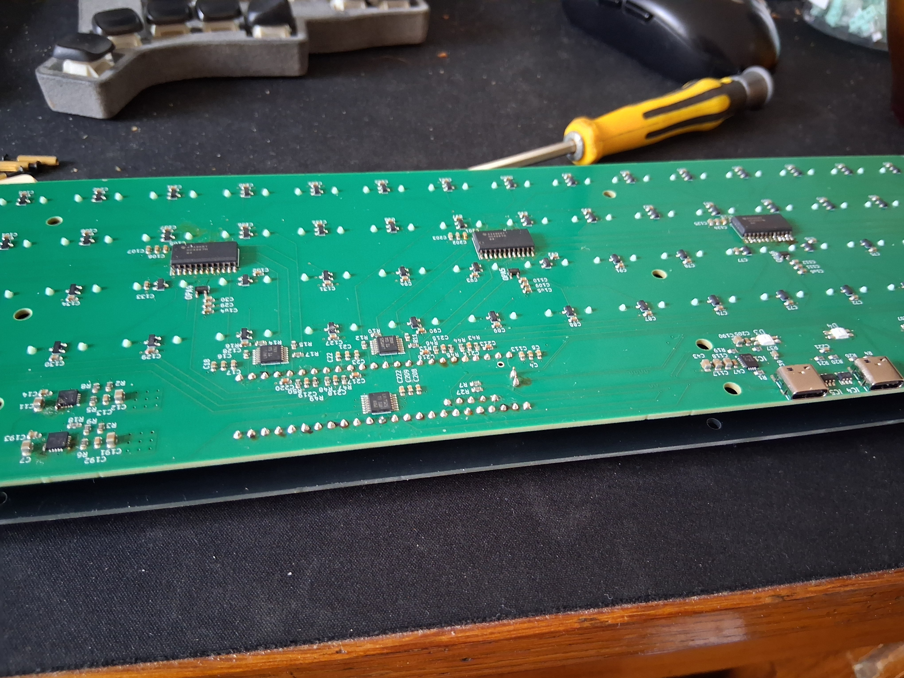

# Clavicore 0.1

Le Clavicore est un contrôleur midi basé sur la disposition Janko. Le jeu est dynamique. 
Il fonctionne grâce à des interrupteurs MX magnétiques standards et un Teensy 4.1.  

---

## JANKO LAYOUT

Contrairement à un piano standard, l’écart physique entre les touches correspond à l’écart musical entre les notes. Il y a un ton de différence sur les lignes et un demi-ton sur les colonnes. Toutes les gammes partagent le même doigté pour des accords identiques et sont jouées de la même manière.  

https://en.wikipedia.org/wiki/Jank%C3%B3_keyboard

## FONCTIONNEMENT

Sous chaque touche, un capteur hall génère le voltage relatif à la position de l’aimant dans la switch. Le microcontrôleur identifie le voltage correspondant à la position haute et basse de chaque touche. On mesure le temps passé entre l’état "touche au repos" et l’état "touche pressée" pour connaitre la vitesse de frappe et attribuer une vélocité au signal midi.

La difficulté est de suivre simultanément et avec précision la position des 120 touches. Avec quelques multiplexeurs, buffers et autres, j’arrive à environ 13 000 échantillons de position par seconde et par touche. Au delà, les ADC du Teensy ne suivent plus. 

Le programme a été vibe codé. Ça fonctionne. Des ajustements doivent encore être faits au niveau de la calibration des touches, de la courbe de vélocité, etc.

## DÉMONSTRATION

Après deux semaines de pratique.  C’est approximatif, il y a encore du boulot, mais je n’ai jamais vraiment fait de musique avant. Je sais qu’il n’y avait pas besoin de s’embêter autant avec un clavier dynamique pour jouer du clavecin.
https://www.youtube.com/shorts/t3_tYI92ahw

Pour la démonstration de la dynamique de jeu. Désolé, le son est moche. Je referai avec un beau piano un de ces jours. 
https://youtube.com/shorts/Zl-sIEAEMYA?feature=share

Pour l’esthétique. C’est du plaqué or. J’ai vectorisé le texte du couvercle d’un clavecin ancien et diverses autres images.  
https://youtube.com/shorts/kKriU0rGM7M?feature=share

## LA SUITE

* Faire un vrais boitier
* Utiliser des keycaps profilées pour faciliter le jeu avec le pouce. J’ai commandé l’impression 3D, j’attend : https://github.com/heyitscassio/PseudoMakeMeKeyCapProfiles
* Ajouter une cinquième lignes de touche ? 
* Intégrer quelques instruments directement dans le Teensy, si possible ? Voir un séquenceur, etc. 
* Ajouter une fonction "clavier d’ordinateur", pour rigoler
* Remplacer le Teensy par un STM32 !  

---

### CREDIT

Pour la preuve qu’il est possible de calculer efficacement la dynamique de jeu avec des capteurs halls :  
https://github.com/aleathwick/midi_hammer

Pour la preuve qu’on peut jouer avec des touches MX classiques :  
https://github.com/KOOPInstruments/melodicade_mx